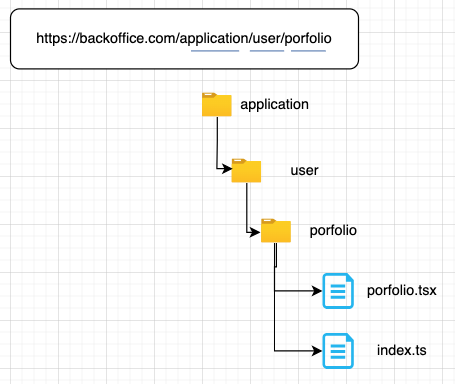

# Backoffice Boilerplate MUI

A simple backoffice boilerplate apps built with React Typescript, and MUI.

## Stack

### FE

- refine (https://refine.dev/)
- react typescript
- MUI

### Tools

- eslint
- prettier
- husky
- lint-staged

## Git replacing LF with CRLF

```
$ git config --global core.autocrlf false
$ git rm --cached -r .
$ git reset --hard
```

## Installation

```bash
# install app's depndencie
$ yarn install

# install node version
Please install at least v20 version node
```

```bash
# install app's depndencie
$ npm install
```

## Scripts

```bash
# install typescript
$ npm install -g typescript
```

```bash
# run dev server
$ yarn run dev

# build for production with minify
$ npm run build

# run as production
$ npm run start

# run `lint` to tell you what is wrong code.
$ npm run lint

# run `format` to format all code based on your prettier and linting configuration.
$ npm run format
```

## Directory sturcture code


````
├── public/          #static files
│   ├── assets/      #assets
|   |    |── images  #images
|   |    |── fonts   #fonts
│   └── index.html   #html template
│
├── src/             #project root
|   |── assets/      #assets file
|   |── components/  #common components reuse
│   ├── configs/     #configs project
|   |── contexts/    #contextApi
|   |── guards/      #guard authenticate
│   ├── hooks/       #hooks custom
|   |── layouts/     #common layouts
|   |── pages/       #pages source
|   |── routes/      #common routes
│   ├── services/    #services source
|   |── themes/      #themes app
│   ├── App.js
│   ├── App.test.js
│   ├── index.js

└── package.json```
````

# Convention code

### Component's file name should be in Snake Case

Eg: product-card.tsx, product-list.tsx, login-form.tsx


### Component having own folders should have a component file with the same name.

This way when we search for files, we don't get a list of <b>index.ts</b> but will receive the actual component files.

#### Create an index.ts file in that component folder which export the named component.

```
import Product from './product';
export default Product;
```

or

```
export { default } from './product';
```

### Pages
Each file in this folder contains its route. A page can contain its sub folder. And every sub folder represent its own route. This folder is confused for yourself when you identify which components are in the pages folder, or in the feature folder. So, I propose we can reference ways the NextJS framework using app router to separate components.



